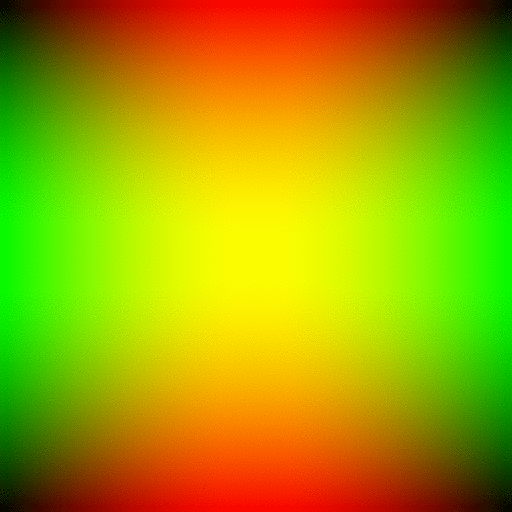

# Hello World

This is my home page! My name is Jesse Dawson and I am a student at [Cal State Fullerton](http://www.fullerton.edu/) and my major is computer science.

## Computer Science Projects

My GitHub page is http://github.com/JesDaw.

### CPSC 120

* Lab 10

    Lab 10 part-1 was one of my favorite projects because it really wasn't until
    the end of the semester until I started to get the hang of our projects.
    I think that this part was the first one I felt completely comfortable on and
    I got some pride with this one since I got to help other groups for the first
    time this year. Even though we were only calculating the area of rectangles I
    thought I had a very good understandings of how functions work, so the smooth
    sailing felt nice. I also learned how to call functions from other files with
    heaters in this project which was cool.
 

* Lab 11

    I actually didn’t like this project until right as I was finishing part 1. 
    I had really had the whole thing finished for hours but something wasn't working
    and I just couldn't understand what. With only about 2 or 3 hours until it 
    was due left I had finally realized that I was getting the rows and the columns 
    of the 2D vector mixed up. I had a bit of a laugh and a lot of relief, and now I 
    don't think I'll be forgetting the syntax of 2 vectors.

* Lab 12

    Out of all the projects I think the result of this one was the coolest.
    I really wasn't expecting to get into making pictures at all this year
    but this project ended with us all making a whole animation and I was 
    really happy to see work in the end. Part one also amazed me with how 
    simple animations can be to make.
 

